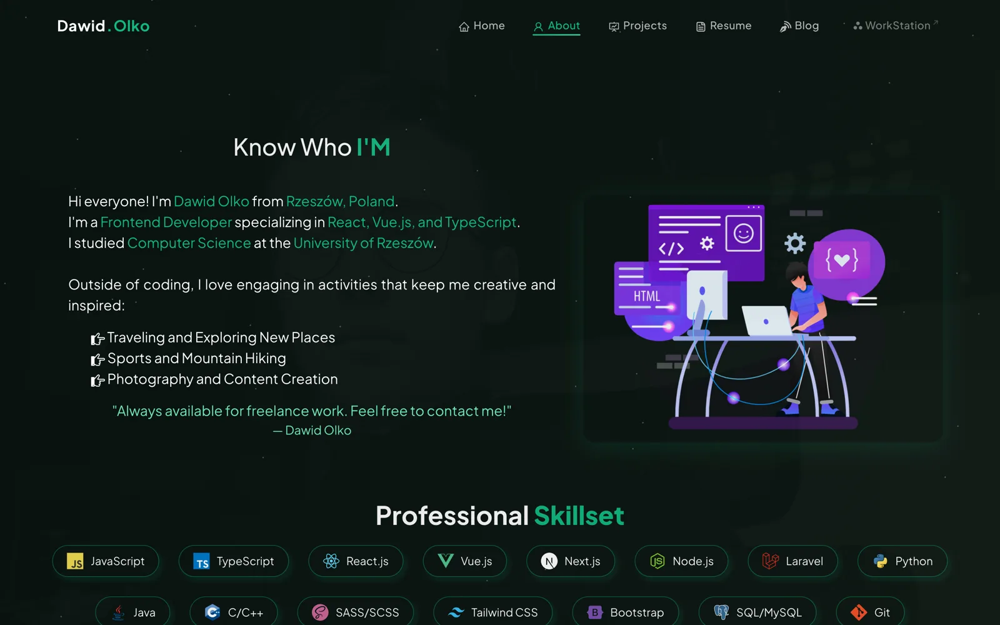
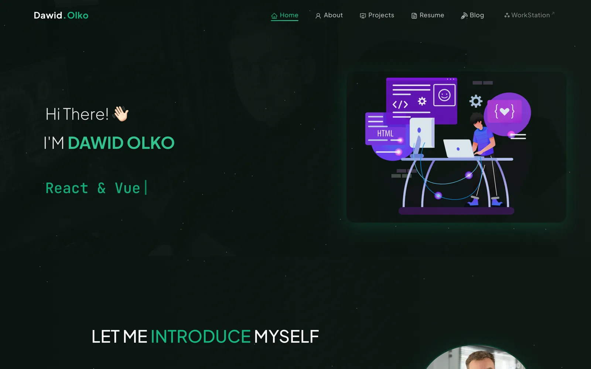
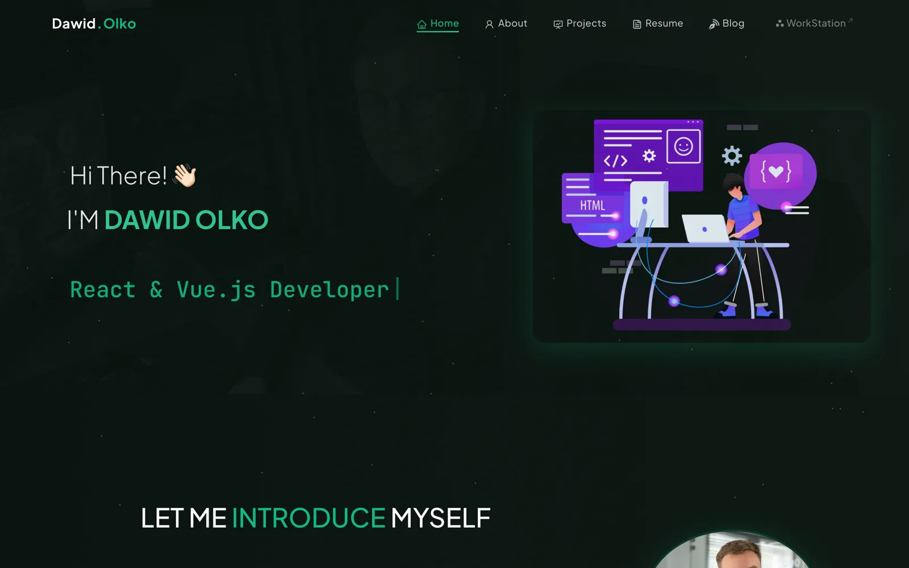

# dawidolko.pl — Portfolio

> Personal portfolio website of **Dawid Olko** — Full-Stack Developer from Rzeszów, Poland.  
> Built with **React.js**, featuring a modern dark theme with emerald accents.

**Live:** [https://olkodawid.dawidolko.pl](https://olkodawid.dawidolko.pl)


---

---

## 🎯 Key Features

- **Modern UI** — Dark theme with glassmorphism navbar, smooth animations, and emerald accent colors
- **Responsive Design** — Fully optimized for mobile, tablet, and desktop
- **Project Showcase** — Card grid with hover overlays, GitHub/Demo/YouTube links
- **Personal Blog** — Photo blog with lightbox viewer (fullscreen with close button)
- **Resume/CV** — Built-in PDF viewer with download option
- **About Section** — Professional skillset badges, toolstack, and GitHub activity calendar
- **SEO Optimized** — JSON-LD structured data, Open Graph tags, Google Search Console integration
- **Performance** — Lazy loading, code splitting, optimized images, preconnect hints
- **Particle Background** — Interactive particle animation across all pages
- **Section Backgrounds** — Subtle greyscale photography backgrounds on each page
- **Back to Top** — Floating scroll-to-top button
- **Custom Font** — Plus Jakarta Sans for a polished, modern look

---

## 🖼️ Screenshots

| Home — animated intro | About — skills & GitHub activity |
|---|---|
| [](docs/screenshots/home.webp) | [](docs/screenshots/about.webp) |

| Projects — card grid | Blog — photo journal |
|---|---|
| [](docs/screenshots/projects.webp) | [](docs/screenshots/blog.webp) |

| Resume — built-in PDF viewer |
|---|
| [](docs/screenshots/resume.webp) |

---

## 🛠️ Technology Stack

| Category       | Technologies                                        |
| -------------- | --------------------------------------------------- |
| **Framework**  | React.js 17                                         |
| **Styling**    | React Bootstrap 5, Custom CSS                       |
| **Routing**    | React Router v6                                     |
| **Animations** | TSParticles, React Parallax Tilt, TypeWriter Effect |
| **Data**       | React GitHub Calendar, Axios                        |
| **PDF**        | React PDF                                           |
| **Icons**      | React Icons                                         |
| **Font**       | Plus Jakarta Sans, JetBrains Mono                   |
| **Deployment** | GitHub Pages via GitHub Actions                     |

---

## 🚀 Getting Started

```bash
# Clone the repository
git clone https://github.com/dawidolko/portfolio.git
cd portfolio

# Install dependencies
npm install

# Start development server
npm start

# Build for production
npm run build
```

---

## 📁 Project Structure

```
src/
├── assets/            # Images, SVGs, backgrounds, tech icons
├── components/
│   ├── About/         # About page, skills, tools, GitHub calendar
│   ├── Blog/          # Blog cards with lightbox and hover overlay
│   ├── Home/          # Landing page, intro, social links
│   ├── Projects/      # Project cards with hover effects
│   ├── Resume/        # PDF resume viewer
│   ├── Navbar.js      # Glassmorphism navigation bar
│   ├── Footer.js      # Multi-column footer with tech badges
│   ├── Particle.js    # TSParticles background
│   ├── Pre.js         # CSS preloader spinner
│   └── ScrollToTop.js # Scroll restoration
├── style.css          # Main stylesheet
├── index.css          # Font imports & base styles
└── App.js             # Router & layout
```

---

## 🚢 Deployment

Automatically deployed to **GitHub Pages** via GitHub Actions on push to `main`.

**Important:** In your GitHub repository settings, set Pages source to **GitHub Actions** (not "Deploy from a branch"). This ensures `index.html` is served instead of `README.md`.

---

## 🔍 SEO & Accessibility

- Google Search Console verified via HTML file and meta tags
- JSON-LD structured data for Person and WebSite schemas
- Open Graph and Twitter Card meta tags
- Canonical URL configured
- `robots.txt` and `sitemap.xml` included

---

## 📄 License

This project is open source under the [MIT License](LICENSE).

---

## 👨‍💻 Author

**Dawid Olko**  
Full-Stack Developer · Rzeszów, Poland

- Website: [olkodawid.dawidolko.pl](https://olkodawid.dawidolko.pl)
- GitHub: [@dawidolko](https://github.com/dawidolko)
- LinkedIn: [dawidolko](https://www.linkedin.com/in/dawidolko/)
- Email: dawid_olko@outlook.com
